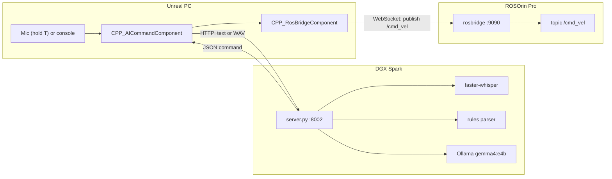

# RosOrinPro Voice Control

**Talk to a real robot from Unreal Engine.** Hold a key, say *"move forward for two seconds"* or *"turn left 90
degrees"*, and the Hiwonder ROSOrin Pro does it. Say *"stop"* and it stops.

Speech recognition (Whisper) and language understanding (a local Ollama LLM) run on an **NVIDIA DGX Spark**.
**Unreal Engine** records your voice, sends it there, and drives the robot over **rosbridge** (`/cmd_vel`).
Nothing goes to the cloud.



## Features

- **Voice or text.** Push-to-talk (T key or a VR controller button), or type `AskAI "turn around"` in the Unreal console.
- **Fast.** Common commands are parsed by rules in milliseconds. About 0.4 s from releasing the key to the robot
  moving, most of it speech recognition.
- **Understands normal speech.** Anything the rules don't cover ("scoot up a tiny bit", "don't go forward") goes to a
  local LLM that is forced to answer in a strict JSON schema.
- **Amounts.** *"forward 50 cm"*, *"back for 3 seconds"*, *"turn right 90 degrees"*, *"turn around"*,
  *"slide left slowly"*.
- **Safety first.** "stop" never waits for the AI. Misheard commands stop the robot. An emergency-stop key works
  without the AI. Stale answers are dropped. Moves have a time limit. The LLM can't invent a direction.
  See [docs/safety.md](docs/safety.md).
- **Same pattern as `syngenta-ai-bridge`.** The AI decides *what*, and Unreal does it.

## Test results

Run on the DGX Spark with synthetic speech (Piper TTS) packed exactly the way the Unreal code packs microphone audio.
See [docs/testing.md](docs/testing.md).

| Test | Result |
|---|---|
| Parser unit tests (rules + LLM) | **64 / 64 pass** |
| 80 randomized "stop"-type voice clips (stop, halt, wait, freeze, no…) | 75 stop · 5 unknown · **0 moves** |
| 40 randomized movement voice clips | **40 / 40 correct** |
| "stop" sent while a slow LLM request is running | answered in **3 ms** |
| Voice latency, rule-based command (WAV upload → JSON) | ≈ 0.4 s |
| Voice latency, LLM fallback | ≈ 1.5 s |

> **Status:** the server side is built and tested end to end. The Unreal C++ was reviewed carefully against the
> UE 5 APIs but **has not been compiled or tested on the robot yet**, because no Unreal Engine is installed on the build
> machine. Use the [first-run checklist](docs/testing.md#first-run-checklist-on-the-real-robot).

## Quick start

**1. Server (DGX Spark)**

```bash
git clone https://github.com/MatinEsmaeili00/RosOrinPro-Voice-Control.git
cd RosOrinPro-Voice-Control
python3 -m venv .venv && .venv/bin/pip install -r requirements.txt
ollama pull gemma4:e4b          # any Ollama model works, see docs/server.md
./run.sh                        # http://<spark-ip>:8002/health
```

**2. Unreal**

1. Copy `unreal/Source/*` into your project's source folder.
2. Add `"HTTP", "AudioCapture", "AudioCaptureCore"` to your `Build.cs`.
3. Enable the **Audio Capture** plugin.
4. Rebuild from your IDE.
5. Set **AI Server URL** on the robot's *AICommand* component.

Full guide: [docs/unreal.md](docs/unreal.md).

**3. Talk**

| Input | Action |
|---|---|
| Hold **T**, speak, release | voice command |
| **X** | emergency stop (no AI involved) |
| `~` console → `AskAI "move forward 1 meter"` | typed command |
| Your robot movement keys | manual driving, which always overrides the AI |

## Repository layout

```
├── server.py              FastAPI server: /health, /command_text, /command_voice
├── robot_commands.py      text → robot command: rules, then Ollama LLM, plus validation
├── test_commands.py       parser unit tests (python test_commands.py [--llm])
├── run.sh                 starts the server on port 8002
├── requirements.txt
├── unreal/Source/
│   ├── CPP_AICommandComponent.h/.cpp   NEW: mic, HTTP, executes AI commands
│   ├── CPP_RosOrinPawn.h/.cpp          robot pawn (+ AICommand component)
│   ├── CPP_PlayerController.h/.cpp     input (+ push-to-talk, stop key, AskAI)
│   └── CPP_RosBridgeComponent.h/.cpp   rosbridge WebSocket, /cmd_vel, /odom (unchanged)
├── tools/
│   ├── voice_pipeline_test.py          end-to-end voice tests with synthetic speech
│   └── whisper_benchmark.py            compares Whisper model sizes
└── docs/                               full documentation (below)
```

## Documentation

| Doc | Contents |
|---|---|
| [Architecture](docs/architecture.md) | components, network, data flow, design decisions, coordinate conventions |
| [Server](docs/server.md) | DGX Spark setup, configuration, HTTP API, Whisper and Ollama details |
| [Unreal](docs/unreal.md) | installation and a walkthrough of every class and setting |
| [Commands](docs/commands.md) | what you can say, how parsing works, the JSON protocol |
| [Safety](docs/safety.md) | every safety layer and why it exists |
| [Testing](docs/testing.md) | how it was tested, full results, first-run checklist for the real robot |
| [Troubleshooting](docs/troubleshooting.md) | common problems and fixes |
| [Development log](docs/development-log.md) | what was built, decisions made, bugs found and fixed |
| [Resources](docs/resources.md) | references for ROS, rosbridge, Whisper, Ollama, Unreal APIs, and more |

## Hardware and software

| | |
|---|---|
| Robot | Hiwonder ROSOrin Pro (ROS 2, Jetson Orin, mecanum chassis), `rosbridge_server` on port 9090 |
| AI computer | NVIDIA DGX Spark: Ollama (`gemma4:e4b`), faster-whisper `base` (CPU int8), Python 3.12 |
| Game engine | Unreal Engine 5 (Enhanced Input, WebSockets, HTTP, Json, Audio Capture) |
