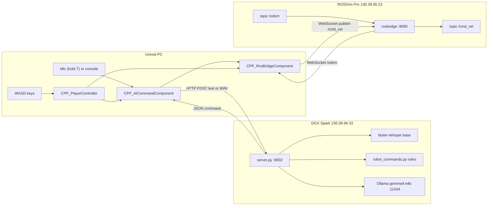
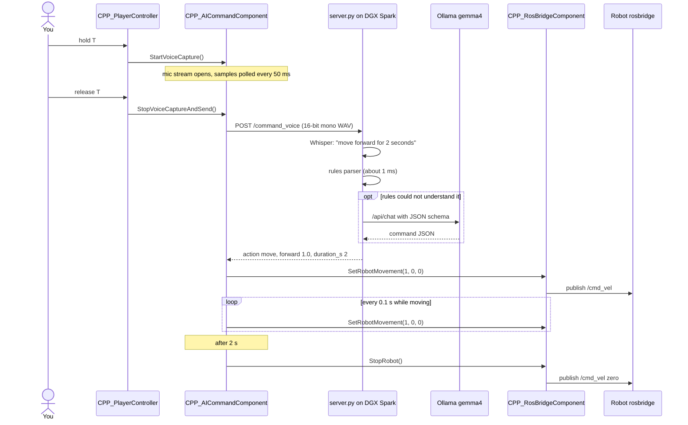

# Architecture

## The three machines

| Machine | Address | Runs | Talks to |
|---|---|---|---|
| **Unreal PC** | (your workstation) | Unreal project with `CPP_RosOrinPawn`, `CPP_PlayerController` | DGX Spark over HTTP, robot over WebSocket |
| **NVIDIA DGX Spark** | `130.39.94.33` | `server.py` on port **8002**, Ollama on `localhost:11434` | answers the Unreal PC |
| **ROSOrin Pro robot** | `130.39.95.23` | ROS 2 + `rosbridge_server` on port **9090** | Unreal PC |

The DGX Spark never talks to the robot. Only Unreal publishes to `/cmd_vel`, the same way it already did for keyboard
driving.

## One voice command, step by step

Typed commands (`AskAI "..."`) skip the microphone and Whisper and go to `POST /command_text`.

## Why Unreal executes the commands

The server only **decides** what to do. It sends back a small JSON command, and **Unreal carries it out**. This is
the same split as `syngenta-ai-bridge`, where the AI names the object and Unreal/Godot highlights it.

| Reason | Detail |
|---|---|
| One owner of `/cmd_vel` | Keyboard and AI both go through `CPP_RosBridgeComponent::SetRobotMovement`, so they can't fight over the robot. |
| Speed limits in one place | The AI sends -1…1 values. `LinearSpeed`, `TurnSpeed` and `DeadZone` on the RosBridge component turn them into m/s and rad/s. |
| Connection already exists | Unreal already holds the rosbridge WebSocket and the `/odom` subscription. |
| Safety close to the user | The emergency-stop key, manual override and stop-on-exit all act locally, without a network round trip. |
| Digital twin stays in sync | The robot pawn in Unreal keeps following `/odom` no matter who drives. |

## Coordinate conventions

The server uses the ROS convention ([REP 103](https://www.ros.org/reps/rep-0103.html)), the same one
`geometry_msgs/Twist` on `/cmd_vel` uses:

| JSON field | Range | Positive means | Becomes |
|---|---|---|---|
| `forward` | -1…1 | drive forward | `linear.x = forward × LinearSpeed` |
| `strafe` | -1…1 | slide **left** | `linear.y = strafe × LinearSpeed` |
| `turn` | -1…1 | rotate **left** (counter-clockwise, seen from above) | `angular.z = turn × TurnSpeed` |

If the real robot slides or turns the wrong way, tick `bInvertStrafe` / `bInvertTurn` on the AICommand component.

The existing odometry code maps ROS to Unreal as `X_unreal = X_ros × 100`, `Y_unreal = −Y_ros × 100` (meters to cm,
and ROS is right-handed while Unreal is left-handed). It copies only position, not orientation, so the pawn doesn't
rotate when the robot turns.

## Design decisions

| Decision | Chosen | Why |
|---|---|---|
| Who publishes `/cmd_vel` | Unreal | see above |
| Parser | rules first, LLM as fallback | "stop" and simple moves must be instant and deterministic. The LLM adds flexibility, not the safety path. |
| LLM output | Ollama native `/api/chat` with a JSON **schema** in `format` | The model can only produce valid commands. `think: false` and `temperature: 0` keep it fast and repeatable. |
| Who writes the spoken reply for moves | the server, from the validated values | The reply always matches what the robot will actually do, even after clamping. |
| One move per sentence | yes | Simpler and more predictable. "X then Y" runs the first part. |
| Continuous moves | re-published at 10 Hz, 20 s limit | Works whether or not the robot's base has a `cmd_vel` timeout, and never runs away forever. |
| Distances and angles | turned into time in Unreal | Unreal knows the real speeds. Open loop, see limits in [safety.md](safety.md). |
| Whisper model | `base`, CPU int8 | Fastest option. `small.en` was 3× slower and no better on short commands ([testing.md](testing.md#3-whisper-model-comparison)). |
| Mic capture | `Audio::FAudioCaptureSynth` (AudioCaptureCore) | Pure C++, no submix or asset setup. Uses the same open/abort pattern as Unreal's own `UAudioCaptureComponent`. |
| Audio format | 16-bit mono PCM WAV at the mic's native rate | Whisper resamples internally. Mono halves or quarters the upload size. |
| Port | 8002 | `syngenta-ai-bridge` uses 8001, so both can run at once. |
