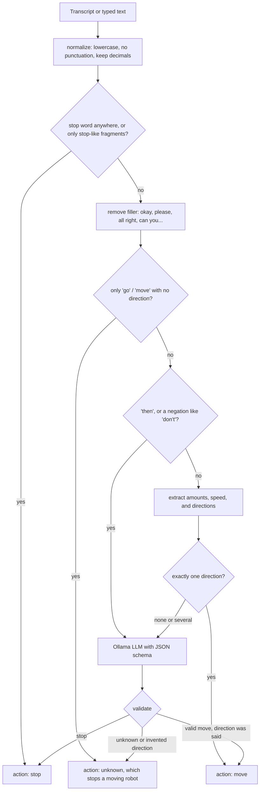

# Commands

## What you can say

One move per sentence. Amounts are optional. Without one, the robot moves until you say stop (at most
`MaxMoveSeconds`, 20 s by default).

| Command | Examples |
|---|---|
| `forward` | "move forward", "go straight", "go ahead", "drive ahead three seconds", "forward 1.5 meters" |
| `backward` | "back up", "go backward", "reverse for a second", "go back a little" |
| `turn_left` | "turn left", "rotate 45 degrees to the left", "counterclockwise", "turn around" (180°) |
| `turn_right` | "turn right 90 degrees", "spin clockwise", "turn right ninety degrees" |
| `strafe_left` | "slide to the left", "move left", "strafe left" |
| `strafe_right` | "slide to the right for 2 seconds", "go right 30 centimeters" |
| `stop` | "stop", "halt", "wait", "hold on", "freeze", "no", "cancel", "whoa", "robot stop" |

Tip: "slide" is recognized more reliably than "strafe", and "stop stop" or "robot stop" more reliably than one short
"Stop!".

### Amounts

| Kind | Understood |
|---|---|
| Time | `2 seconds`, `2 s`, `a second`, `three seconds`, `half a second`, `a minute` |
| Distance | `1 meter`, `1.5 m`, `50 cm`, `2 feet`, `6 inches`, `a yard`, `half a meter` |
| Angle | `90 degrees`, `ninety degrees`, `45°`; "turn around" = 180, "full circle" = 360 |
| Number words | one…twelve, fifteen, twenty, thirty, forty, forty-five, sixty, ninety, one eighty, a couple, a few, one and a half |
| Vague | "a little", "a bit", "slightly" = 1 second |
| Speed | "slowly", "carefully", "gently" = half speed; normal = full `LinearSpeed` / `TurnSpeed` |

Distances and angles are converted to time in Unreal using `LinearSpeed` (0.08 m/s) and `TurnSpeed` (0.30 rad/s).
For example, "forward 1 meter" = 12.5 s, and "turn left 90 degrees" = 5.2 s. That makes the default
`MaxMoveSeconds = 20` about 1.6 m or 344°. Longer requests are capped, and a warning is logged.

### Things the LLM handles

Anything the rules don't cover goes to the LLM, for example:

| You say | Result |
|---|---|
| "scoot up a tiny bit" | forward, 1 s |
| "don't go forward" | stop |
| "rotate so you're facing the opposite direction" | turn_left, 180° |
| "go forward then turn left" | forward (first step only) |
| "what's the weather like?" | unknown ("I can only help with robot movements") |
| "scoot over a tad" | unknown: the LLM guessed strafe_right, but no side was said, so it was rejected |

## How parsing works



### Rules (`parse_with_rules`)

1. **Normalize**: lowercase, `°` → "degrees", hyphens → spaces, apostrophes removed ("don't" → "dont"), other
   punctuation removed, dots kept only inside numbers ("1.5").
2. **Stop check** (before anything else):
   - any stop word anywhere (`stop`, `halt`, `freeze`, `brake`, `wait`, `pause`, `hold on`, `cancel`, `dont move`, …), or
   - the whole utterance is "no" / "nope", or
   - the whole utterance (≤ 3 words) is made of **stop-like fragments**. These are what Whisper produced for a shouted
     "Stop!" / "Halt!" / "Freeze!" in testing: `so, sup, soap, up, sub, top, job, jump, hope, chop, please, salt,
     stump, dope, …`
3. **Filler removal**, so "All right, go forward" doesn't become "strafe right".
4. **Bare "go" / "move" / "drive"** with no direction → `unknown` ("Which way?"). Whisper once heard "Stop!" as
   "Go!", so this is never guessed.
5. **Multi-step ("then") or negation ("don't", "not")** → LLM.
6. **Amounts**: the first time, distance and angle found.
7. **"Turn around" / "full circle"** → turn 180° / 360° (right only if "right" or "clockwise" is said).
8. **Directions**: patterns are checked in order, and each match is **removed** before the next check. So "turn left"
   counts only as a turn, not also as "left" = strafe:
   `counterclockwise → clockwise → turn…left → turn…right → strafe/slide…left → …right → left → right → back… →
   forward/ahead/straight/front`. Up to four words may sit between the verb and the side ("rotate 45 degrees to the
   left").
9. **Exactly one direction** → command. None or several → LLM.

"up" is deliberately **not** a forward word. Whisper turned a shouted "Stop!" into "So, up." once, and "up = forward"
made that a forward move. See the [development log](development-log.md#4-a-misheard-stop-that-would-have-driven-forward).

### LLM (`call_llm`)

- Ollama native `POST /api/chat`, `format` = JSON schema, `think: false`, `temperature: 0`, `keep_alive: 1h`.
- The system prompt describes the robot (mecanum: drive, slide, rotate), the 8 allowed commands and the numeric
  fields. Rules for the model: first step only, "a little" = 1 s, never invent numbers, short fragments like
  "so/sup/up" mean stop, and when unsure do **not** move.
- **Validation after the model answers:**
  - `command` must be one of the 8 values. Anything else becomes unknown.
  - **Direction guard**: a `strafe_*` needs a word like left/right/side/sideways/slide in the text, and a `turn_*`
    needs left/right/turn/rotate/around/clockwise/opposite/degrees. Otherwise the answer is rejected.
  - Numbers are clamped: speed 0.2–1.0, duration ≤ 120 s, distance ≤ 20 m, angle ≤ 1080°. Distance is only allowed
    for drives, and angles only for turns.
  - The direction vector comes from a fixed table, never from the model.
  - For moves, the **server** writes the spoken reply from the final values, so it always matches what will happen.
    For unknown answers the model's own reply is used.
- If Ollama is down, simple commands still work through the rules. Everything else returns unknown with "My AI brain is
  not responding…".

## JSON protocol

The server answers every command with:

| Field | Type | Meaning |
|---|---|---|
| `transcript` | string | what was heard (voice) or received (text) |
| `action` | `move` / `stop` / `unknown` | what Unreal should do |
| `command` | string or null | `forward`, `backward`, `strafe_left`, `strafe_right`, `turn_left`, `turn_right`, `stop` |
| `forward` | -1…1 | + forward (→ `linear.x`) |
| `strafe` | -1…1 | + **left** (→ `linear.y`) |
| `turn` | -1…1 | + **left / counter-clockwise** (→ `angular.z`) |
| `duration_s` | ≥ 0 | seconds. 0 = until "stop" (capped by `MaxMoveSeconds`) |
| `distance_m` | ≥ 0 | meters (drives only). Unreal turns it into time |
| `angle_deg` | ≥ 0 | degrees (turns only). Unreal turns it into time |
| `spoken_response` | string | short reply for the user |
| `source` | `rules` / `llm` / `error` | who decided |
| `latency_ms` | int | server processing time (including Whisper for voice) |

Examples:

```json
{"transcript":"Move backward slowly.","action":"move","command":"backward","forward":-0.5,"strafe":0.0,"turn":0.0,
 "duration_s":0.0,"distance_m":0.0,"angle_deg":0.0,
 "spoken_response":"Moving backward slowly. Say stop when you want me to stop.","source":"rules","latency_ms":2}

{"transcript":"So, up.","action":"stop","command":"stop","forward":0.0,"strafe":0.0,"turn":0.0,
 "duration_s":0.0,"distance_m":0.0,"angle_deg":0.0,"spoken_response":"Stopping.","source":"rules","latency_ms":408}
```
